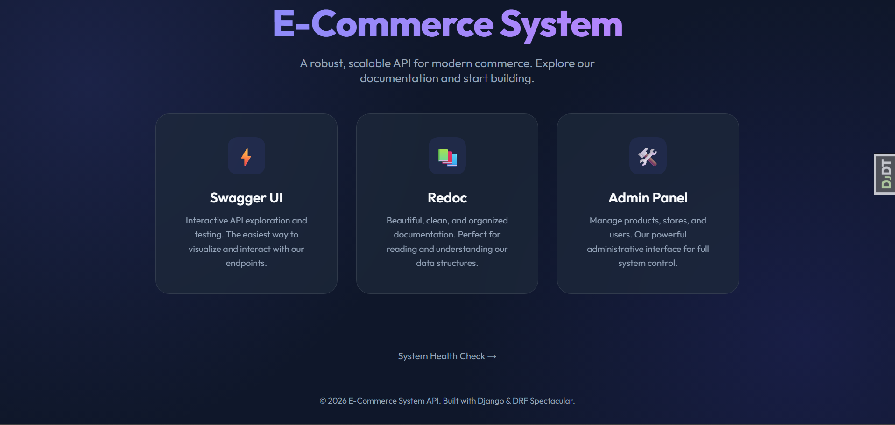

# 🚀 Premium E-Commerce System



A professional, high-performance E-Commerce backend built with **Django** and **Django Rest Framework**, featuring a multi-role architecture, automated moderation, and a modern frontend hub.

---

## ✨ Key Features

### 👤 Multi-Role User Management

-   **Customers**: Browse products, manage profiles, save addresses, and place orders.
-   **Sellers**: Create stores, manage product catalogs, and track orders.
-   **Staff**: Platform-wide moderation, store approval/rejection, and analytics.
-   **Security**: JWT-based authentication with `SimpleJWT` and granular permission classes.

### 🏪 Store & Product Ecosystem

-   **Store Lifecyle**: Application -> Verification -> Approval -> Active.
-   **Product Moderation**: Automated and manual moderation workflows for quality control.
-   **Inventory Tracking**: Real-time stock management with automatic reduction on purchase.

### 📦 Order & Checkout System

-   **Multi-Vendor Support**: Orders can contain items from multiple stores, with each seller only seeing their part of the order.
-   **Atomic Workflows**: Guaranteed consistency during checkout using database transactions.
-   **Status Tracking**: Comprehensive order status lifecycle from `Pending` to `Delivered`.

### 🎟️ Advanced Discount Engine

-   **Promo Codes**: Support for fixed amount or percentage-based coupons with usage limits and expiration.
-   **Dynamic Sales**: Automatic price calculation for store-wide or category-wide flash sales.

---

## 🛠️ Technology Stack

| Logic                                                                                                 | Database                                                                                                          | Performance                                                                                               | Media                                                                                                             |
| :---------------------------------------------------------------------------------------------------- | :---------------------------------------------------------------------------------------------------------------- | :-------------------------------------------------------------------------------------------------------- | :---------------------------------------------------------------------------------------------------------------- |
|  |  |  |  |
|        |        |                |       |


---

## 📖 API Documentation

The project follows the **OpenAPI 3.0** specification. You can access the documentation through:

-   **⚡ Swagger UI**: [http://localhost:8000/api/schema/swagger-ui/](http://localhost:8000/api/schema/swagger-ui/)
-   **📚 Redoc**: [http://localhost:8000/api/schema/redoc/](http://localhost:8000/api/schema/redoc/)
-   **🛠️ Django Admin**: [http://localhost:8000/admin/](http://localhost:8000/admin/)

---

## 🚀 Getting Started

### Prerequisites

-   Python 3.10+
-   PostgreSQL & Redis
-   Cloudinary Account

### ⚙️ Installation

1. **Clone the repository**

    ```bash
    git clone https://github.com/Ahmed3atef/E-Commerce_System.git
    cd E-Commerce_System
    ```

2. **Setup Environment**

    ```bash
    python -m venv .venv
    source .venv/bin/activate  # Or `.venv\Scripts\activate` on Windows
    pip install -r requirements.txt
    ```

3. **Run Migrations**

    ```bash
    python manage.py migrate
    ```

4. **Start Development Server**
    ```bash
    python manage.py runserver
    ```

---

## 🧪 Testing

We use `pytest` for comprehensive API testing.

```bash
# Run all tests
python -m pytest

# Run specific app tests
python -m pytest order/tests/
```

---

## 📁 Project Structure

```text
├── account/       # User profiles (Customer, Seller, Staff)
├── address/       # Generic Address management
├── analytics/     # Seller dashboard & business metrics
├── core/          # Custom User model & Landing Page
├── discount/      # Coupons & Product Discounts
├── order/         # Order & OrderItems processing
├── product/       # Categories & Product moderation
├── store/         # Multi-vendor store management
├── ECOMMERCE/     # Project configuration & URL routing
```

---

Built with ❤️ for a modern e-commerce experience.
